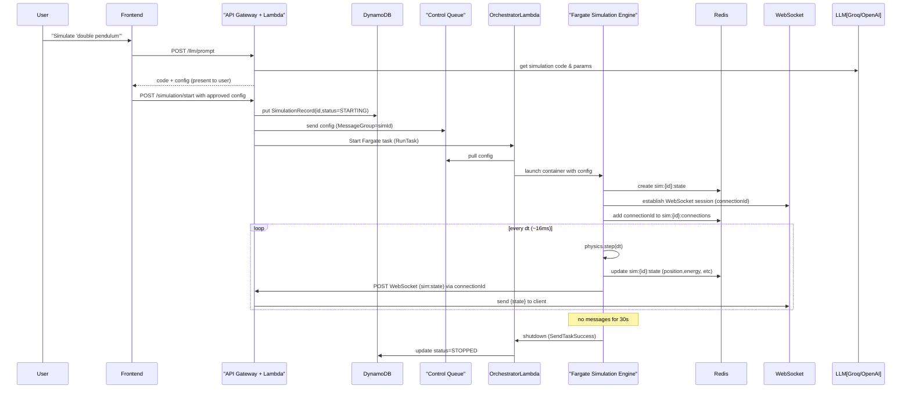

# Executive Summary

This document **transforms SMUL GPSE into a fully serverless, AI-driven simulation platform** by merging the original architecture with modern *harness-engineering* practices【1†L176-L184】【44†L1-L4】. Our vision is an **AI-native simulation operating system**: users describe scenarios in natural language, and the cloud spins up real-time physics simulations (with agents and gestures) in a browser, with *no servers to manage* and *pay‑per‑use* economics. The system is designed for **elastic scaling, multi‑cloud portability, and production‑grade reliability**, leveraging AWS/GCP/Azure serverless services. 

Key highlights:

- **Serverless Compute:** Short-lived control tasks run on Lambda (API, orchestration, LLM parsing); long-running simulation loops run on Fargate/Cloud Run containers (auto‑scale to zero).  
- **Event‑Driven Orchestration:** API Gateway (REST + WebSocket) triggers Lambdas; Lambdas enqueue messages (SQS, EventBridge, Step Functions) to start/stop Fargate tasks; Redis caches live simulation state for sub-ms updates.  
- **Real‑Time Sync:** Fargate tasks broadcast state updates to browsers via WebSocket; gestures from the client flow through WebSocket→Lambda→SQS to affect simulations.  
- **AI & LLM Integration:** LangChain‑like LLM pipelines parse natural language into physics configs; PyTorch agents (trained asynchronously on Fargate spot tasks) act within simulations.  
- **Harness Engineering:** We employ feature flags, canary rollouts, automated rollback, observability‑driven ops, and chaos testing throughout (see *Harness Practices* section). This ensures safe deployment of experimental LLM code and simulation features.  
- **Secure & Observable:** Code generation is sandboxed in containerized runtime, limited capabilities, with automated static analysis (linters, tests) as *feedforward guides* and runtime tracing (OpenTelemetry/X-Ray, CloudWatch) as *feedback sensors*【1†L196-L204】【1†L176-L184】.  
- **Cost & Scaling:** Tables below compare AWS/GCP/Azure options. In general AWS Fargate offers the lowest compute cost【4†L58-L62】, Cloud Run provides seamless scale‑to‑zero with per-request billing【36†L13-L17】, and Azure Container Apps is generally pricier. For NoSQL storage, DynamoDB/Firestore/CosmosDB have trade-offs in consistency and query model. Redis (ElastiCache/Memorystore/Redis Enterprise) choices hinge on scale and advanced features. WebSocket services (AWS API Gateway, Azure Web PubSub) all support millions of connections but with different pricing tiers.  

Below, we detail the **end-to-end architecture and design** (with diagrams), explain the *control vs data planes*, and map out the **simulation lifecycle and event flows**. We present **infrastructure IaC patterns** (CDK/Terraform pseudocode), a **security hardening checklist**, and an **observability blueprint** (metrics, dashboards, alerts). We compare cloud alternatives in tables. Each component’s design is annotated with *harness-engineering* controls (feature flags, canaries, etc.). 

Finally, we provide an **8-week implementation roadmap** with phases, responsibilities, and acceptance criteria. Each phase includes testing/CI/CD plans (unit tests, synthetic monitoring, chaos testing) to validate functionality and reliability. This plan assumes a small core team (devops, backend, frontend, ML) and budget‐aware serverless deployment (no fixed infra cost). Where constraints are unspecified (e.g. budget or SLA), we note them as assumptions.  

By following this blueprint, engineering leads can confidently build SMUL GPSE as a *robust, scalable, serverless simulation IDE*, ready for users and teams to harness AI-driven simulations in production.

## Vision

Our vision is an **“AI-augmented simulation OS”**: a web-based IDE where **natural language, code, and gestures** directly generate, control, and visualize complex simulations (physics + AI agents), all running in the cloud without dedicated servers. Users simply prompt or program a scenario – e.g. *“train a balancing robot with reinforcement learning”* – and the system auto‑provisions the necessary compute, runs it in real time, and streams the visualization. 

- **Serverless by Design:** Every component is managed by cloud services, eliminating ops overhead. The platform scales to many simultaneous simulations (even thousands of parameter sweeps in parallel) and idles at near-zero cost when not in use【4†L58-L62】【36†L13-L17】.  
- **Multi-Cloud Ready:** Abstract container and function layers (ECS/Fargate ↔ Cloud Run/Container Apps) ensure cloud-agnostic portability【44†L1-L4】. Docker images and Terraform/CDK allow running on AWS, GCP, or Azure with minimal changes.  
- **Interactive & Real-Time:** A Redis-backed state bus and WebSocket layer enable low-latency (~60 FPS) updates to browser clients, supporting gestures and collaboration.  
- **AI-Driven:** LLMs (via LangChain-style frameworks【43†L161-L170】) automate code generation and explanation. RL/DL agents (PyTorch) learn within simulations. AI pipelines themselves are orchestrated by serverless workflows (Step Functions).  

This fusion of **serverless infrastructure and harness engineering** yields a platform that is as dynamic and intelligent as it is reliable. We make explicit trade-offs: e.g. use Lambda for intermittent tasks, Fargate for continuous loops (avoiding Lambda’s cold-starts for 60Hz updates【10†L315-L323】【35†L31-L34】). Wherever AI agents or code are involved, we wrap them in *harnesses* (see below) to catch and correct errors before they affect users【1†L196-L204】【1†L176-L184】. The result is a **production‑grade, engineering-ready system design** for SMUL GPSE.

## Core Philosophy

- **Serverless-First & Microservices:** Decompose the system into small, stateless components (API Lambdas, event queues, Fargate tasks). Use managed services (S3, DynamoDB, Redis, etc.) to handle persistence and scaling【13†L54-L62】【15†L268-L277】. No VM or Kubernetes clusters to manage. This maximizes elasticity and minimizes idle cost (pay only for what runs).
- **Infrastructure as Code (IaC):** Define all resources in Terraform or AWS CDK. Version control cloud architecture and enable automated, repeatable deployments. See *Deployment & IaC* for examples.
- **Event-Driven Orchestration:** All system interactions are triggered by events (HTTP/WebSocket messages, queue messages, cron schedules). A Simulation is “Simulation-as-a-Function”: start/stop are API calls that trigger asynchronous workflows (via SQS/Step Functions/ECS RunTask).
- **Stateless Control Plane:** Each Lambda invocation is ephemeral and idempotent. Use DynamoDB or S3 to store durable metadata, and Redis (ElastiCache) for fast ephemeral state. The simulation engine itself runs in containers and stores its latest state in Redis for continuity.
- **Data & Control Separation:** The **Control Plane** (API Gateway, Lambdas, orchestration) handles setup/teardown, user/auth, and queuing. The **Data Plane** (Fargate simulation tasks, physics, agents) does the heavy computation and publishes real-time state.
- **Harness-Engineered:** We anticipate AI/ML unpredictability. We embed feedback loops, progressive rollouts, and safety nets into every stage. E.g., LLM-generated code is checked by linters/tests before execution (feedforward), and runtime monitors/logging catch anomalies (feedback)【1†L196-L204】. Feature flags let us toggle new AI features or models without redeploying the entire system.
- **User-Centric UX:** The client is a static React app (hosted on S3+CDN) with Three.js for 3D, Monaco Editor for code, and MediaPipe for gestures. All “frontend” activities (vision, gestures) run in-browser; complex compute runs in cloud.
- **Open & Extensible:** Use open standards (OAuth/JWT, WebSocket, HTTP). Support plugins via container images that communicate over the same state/bus. Encourage community extensions.

## Architectural Principles

1. **Serverless Containers for Long-Running Workloads:** While Lambda excels at short jobs, our 60 fps simulation loops and agent training are long-running. We run these in containerized ECS/Fargate (or Cloud Run) tasks, which *scale to zero* when idle and support GPUs if needed【10†L328-L336】【36†L13-L17】.  
2. **Lambda for Control Plane:** Use AWS Lambda (or Cloud Functions) for REST endpoints, state orchestration, and LLM interaction. Each Lambda is stateless; shared state is in managed services. This enables high concurrency with minimal setup【10†L266-L274】【10†L297-L304】.  
3. **APIs + WebSockets via API Gateway:** Deploy a unified API Gateway (REST + WebSocket). REST endpoints handle auth, project CRUD, LLM prompts, snapshot requests. WebSocket routes allow bidirectional comms for simulation: e.g. broadcasting state and receiving commands.
4. **Ephemeral State with Redis:** Maintain live simulation state in an in-memory cache (ElastiCache Redis or equivalent). Each sim’s latest world state (objects, time, metrics) is stored under a TTL’d key (e.g. `sim:{id}:state`). This enables fast reads for debugging or snapshotting, and multiple workers to share view.
5. **Message Queues for Decoupling:** Use FIFO SQS queues (MessageGroupId=simulationId) for in-order commands (gestures, AI agent triggers). Use SNS/EventBridge or regular SQS for other async tasks (e.g. snapshotting, training jobs). Step Functions orchestrate complex flows.
6. **Container Image Over Lambda for Sim Engine:** The physics engine (PyBullet, SciPy) and AI agent code can be large and require custom libraries. We pack them into a Docker image. AWS Fargate runs this image. On start, the container pulls config and simulation code from S3/DynamoDB, then loops.
7. **Security-in-Depth:** Each service runs with least privilege (e.g. Lambda roles only access needed tables/queues). We will run Fargate tasks inside a VPC with private subnets, no inbound public access. Simulation code runs in read-only root filesystems, with a seccomp profile limiting syscalls. LLM outputs are sandboxed (no internet, only permitted libs)【41†L49-L53】【41†L64-L72】.
8. **Observability and Alerts:** Each step logs to a central system (CloudWatch Logs or similar). We emit custom metrics (e.g. simulation ticks per second, queue backlog, error counts). Dashboards monitor key flows (see Observability section). Set SLOs (e.g. 99% frames delivered within 50ms) and alarms for degradation.
9. **Cost-Efficiency:** Exploit serverless billing (per-request, per-second compute). Idle sims incur no costs (tasks shut down after inactivity). Use spot capacity for training tasks. Employ autoscaling/lambda concurrency controls to cap cost. See *Cost Model*.
10. **Cloud-Agnostic Abstractions:** Use Terraform or CDK to allow deploying on AWS/GCP/Azure interchangeably. For example, abstract “Serverless Container” layer: on AWS it’s ECS Fargate, on GCP it’s Cloud Run with min_instances=0, on Azure it’s Container Apps. Similar for Redis/DB via Terraform multi-provider modules.
   
## High-Level Topology

```mermaid
flowchart LR
  subgraph Client
    A[React/Web App (browser)]
  end
  subgraph Gateway
    B[/AWS API Gateway (REST)\] 
    C[/AWS API Gateway (WebSocket)\]
  end
  subgraph AWSLambda["AWS Lambda Handlers"]
    AuthLambda["auth.*"]
    ProjectLambda["projects.*"]
    LLMLambda["llm.*"]
    SimAPI["simulation.{start,stop,status,snapshot}"]
    WSHandler["ws.connect/disconnect/send"]
    Orchestrator["simulation.orchestrator"]
  end
  subgraph Messaging
    QControl[(SQS FIFO)]
    EventBus[(EventBridge/SQS)]
    Redis[(ElastiCache Redis)]
    DDB[(DynamoDB)]
    S3[(S3 Storage)]
  end
  subgraph SimulationTask
    Fargate["Fargate Simulation Engine"]
  end

  A -->|HTTP| B
  A -->|WebSocket| C
  B --> AuthLambda
  B --> ProjectLambda
  B --> LLMLambda
  B --> SimAPI
  C --> WSHandler

  AuthLambda --> DDB
  ProjectLambda --> DDB
  LLMLambda --> DDB
  LLMLambda -->|calls| LLM[Groq/GPT API]
  SimAPI --> DDB
  SimAPI --> QControl
  SimAPI --> Orchestrator
  Orchestrator -->|RunTask| Fargate
  Orchestrator -->|Enqueue| QControl

  WSHandler --> QControl
  WSHandler --> Orchestrator

  Fargate --> Redis
  Fargate --> DDB
  Fargate -->|publish| C
  Fargate -->|publish| EventBus

  QControl --> Fargate
  EventBus --> Trainer["Fargate Trainer Task"]

  Trainer --> S3
  Trainer --> DDB
  Trainer --> WSHandler
```

**Figure:** *Logical components and data flows.* The browser (A) serves the static UI (from S3/CloudFront) and opens an API Gateway WebSocket connection (C). REST calls (B) invoke Lambda handlers (bottom) for auth, projects, LLM parsing, and simulation control. The “Simulation Start” handler enqueues the config on SQS (QControl) and triggers the Orchestrator Lambda, which calls ECS/Fargate to launch a container. The Fargate task pulls config, initializes the PyBullet engine, and enters the simulation loop. At each step, it writes state to Redis and sends updates via the WebSocket (API Gateway → client). User gestures are sent back over WebSocket, handled by a Lambda that enqueues them to SQS. Training jobs are spawned via Step Functions (EventBus) as separate Fargate tasks. All persistent data (projects, user metadata, snapshots) lives in DynamoDB/S3 (not shown). 

## Event Flow (Simulation Start)

When a user initiates a simulation, the flow is:



**Figure:** *Simulation start and run sequence.* The user’s request triggers the LLM Lambda, then on approval, the `simulation.start` Lambda enqueues the job and runs a Fargate task. The task initializes Redis and the WebSocket link, then enters a loop: stepping physics, caching state, and pushing it to clients. If the task idles (e.g. no active connections) for a timeout, it self-terminates and updates the simulation status. 

## Data Plane vs Control Plane

- **Control Plane:** Comprises API Gateway, Lambda functions, and orchestration (SQS/Step Functions). It handles user requests, scheduling of Fargate tasks, authentication, and management of metadata. Control plane is **stateless**: any Lambda invocation must fetch state from databases/cache or be idempotent. E.g., `/simulation/start` Lambda writes to DynamoDB and SQS, then returns immediately without waiting for the sim to run.
- **Data Plane:** The Fargate simulation engine is the data plane. It processes the simulation loop, physics, AI agent actions, and directly writes state to Redis and streams it out. It holds the “single source of truth” for an active simulation’s runtime data (position of objects, energy metrics, agent observations). The data plane also includes long-running training tasks and plugin containers – any component that *executes the domain logic* continuously.
- *Separation Rationale:* Control plane Lambdas scale to handle millions of concurrent requests effortlessly, but cannot do high-frequency simulation due to startup overhead. Thus, they simply orchestrate; the continuous heavy lifting is offloaded. All persistent/snapshotted data (user projects, snapshots, models) is written to durable stores (DynamoDB/S3) which both planes can access.

## Simulation Lifecycle

1. **Initialization:** User calls `/simulation/start`. A DynamoDB record is created (status=PENDING). SQS receives the config. ECS RunTask launches the container (cold start ~10s).
2. **Warmup:** Fargate task pulls config, loads physics libraries (PyBullet), initializes world and agents. Registers itself in Redis. Opens WebSocket via API Gateway using a saved connection ID.
3. **Running:** A tight loop runs at ∼60 Hz: physics.step(), agents.act(), state update. After each step it updates Redis and sends `sim:state` via WebSocket. This continues until the user stops or the task times out. Gestures or commands from user are received via WebSocket->Lambda->SQS and consumed mid-loop. 
4. **Termination:** If `/simulation/stop` is called or idle timeout (no clients for 30s) elapses, the Fargate task exits gracefully. It sends a final update (status=COMPLETED or CANCELLED) back to the orchestrator Lambda, which updates DynamoDB.
5. **Snapshot:** At any point the frontend can call `POST /simulation/{id}/snapshot`. A Lambda reads the latest state from Redis, serializes it, and stores it in S3 (with metadata in DynamoDB). This allows resuming or offline analysis.
6. **Resumption:** If a user wants to resume a paused sim, the same process as start is used but the initial state blob is loaded from the snapshot S3 into the new container.
7. **Background Jobs:** Periodic or asynchronous tasks (e.g. model training, batch simulations) are handled via EventBridge-triggered Lambdas or Step Functions, queuing long jobs on Fargate Spot. Their progress is streamed back via WebSockets or logged.

## State Management

- **Redis (ElastiCache Serverless):**  
  - *Live state storage:* Each simulation has keys like `sim:{id}:state` (the latest state JSON) and `sim:{id}:connections` (set of WebSocket connection IDs). This supports broadcasting to multiple clients. Redis keys use TTL to auto-expire inactive sims.  
  - *Properties:* Sub-ms read/write, auto-scaling, no operational overhead. Chosen over in-container memory because we may restart tasks or have multiple replicas for load (e.g. agent training might write to the same Redis store for federation).  
- **DynamoDB + S3:**  
  - *Metadata:* Tables for Users, Projects, Simulations (id, status, config, timestamps), Snapshots, Models. DynamoDB’s strong consistency (if needed) ensures simulation status updates are reliably stored.  
  - *Blobs:* S3 stores large payloads – simulation code, snapshots, ML model weights, logs. Use versioning and server-side encryption.  
- **CQRS Patterns:** Simulation writes go to Redis; final or summary writes go to DynamoDB/S3. For example, final energy plots might be pushed to S3 via a snapshot. We avoid double-writes per physics step.  
- **Optimistic Concurrency:** For critical updates (e.g. assignment of simulation IDs, finalizing states) we use DynamoDB conditional writes or transactions to prevent conflicts.  

## Real-time Synchronization

Real-time updates and commands are handled via WebSocket and Redis:

- **WebSocket (API Gateway):**  
  - Clients open a persistent WS connection. Lambda connect handler records `connectionId`.  
  - On each physics step, the Fargate task makes an HTTP POST to API Gateway’s WebSocket endpoint (`$default` route), sending JSON `{ action: "sim:state", payload: {objects,energy,...} }`.  
  - API GW routes this to a Lambda `ws.send` which forwards it to the client. (Alternatively, Fargate can push directly using AWS SDK with connectionId).  
  - This pub/sub model supports multiple clients (same `simId`): each `sim:{id}:connections` in Redis lists recipients.  
- **Commands (gestures, UI input):**  
  - When the frontend detects a gesture or user command (e.g. “apply force”), it sends `sim:command` via the WS. API GW invokes a Lambda which validates and enqueues the command to SQS with the same `simId`.  
  - The Fargate loop periodically polls SQS (MessageGroup ensures order). Upon receiving a command, it immediately applies the force or action to the simulation. This decouples user input from the physics loop safely.  
- **Backpressure & Rate:** We expect the physics loop to generate ~60 messages/sec per simulation. API Gateway can handle thousands of WS messages/sec. Redis pub/sub overhead is minimal. We use batch updates (e.g. only send changes, not every millisecond state) to reduce load.  
- **Consistency:** Since the loop is single-threaded, state broadcasts strictly follow physics time. If the frontend lags, it may skip frames. We include a `timestamp` or `stepId` in state messages for alignment.

## Orchestration Layer

The orchestration layer glues components via events:

- **Simulation Orchestrator (Lambda):** Handles high-level task management. E.g. `/simulation/start` Lambda calls `RunTask` on ECS via AWS SDK; `/simulation/stop` sends a SQS message to tell the Fargate loop to exit gracefully (or directly calls `StopTask`). This layer also monitors SQS for new configs or step functions for training triggers.
- **SQS FIFO (Control Queue):** A single FIFO queue per project (or one for all, with `MessageGroupId=simId`) ensures commands and config messages for each sim are in order. Fargate polls it on each loop iteration. Dead-letter queue catches failed messages (and triggers an alert).
- **Step Functions (Async Workflows):** For multi-step processes (e.g. training RL agents over many episodes), a Step Function workflow can coordinate multiple Fargate tasks. For example, it might: start a trainer container, wait for a S3 model output, update DynamoDB, loop until convergence. This is fully serverless orchestration.
- **EventBridge (Scheduling):** Periodic tasks (nightly data cleanup, metrics snapshots) and triggers from external events use EventBridge rules to invoke Lambdas. For example, a cron rule could `POST /simulation/stop` for stale sims.

Every transition in the orchestration layer is **audit-logged** (CloudTrail/X-Ray enabled) and instrumented for metrics (e.g. tasks started, queue depth) to ensure we can trace failures.

## Execution Engine (Fargate Simulation Task)

- **Container Image:** Based on a Linux image (Debian/Alpine), preinstalled with Python 3.11, PyBullet, NumPy, SciPy, PyTorch, etc. The image uses a non-root user, has a minimal footprint, and a locked-down seccomp profile (dropping unnecessary syscalls)【41†L49-L53】.  
- **Startup:** On launch, the container’s `main.py` reads its `simulationId` and config from SQS/S3. It also downloads any needed user files/models from S3. Environment variables or AWS credentials (via IAM role) allow limited access to S3, Redis, and CloudWatch.  
- **Simulation Loop:** A single-threaded asyncio loop runs `physics.step(dt)`, then `for agent in agents: agent.act(state)`. We aim for ~60 Hz. After each step, it publishes the new state. If a new SQS command arrived, it applies it (e.g. add_force). The loop monitors elapsed wall-clock and stops if an API call requested termination or if idle.  
- **Agent Execution:** AI agents (e.g. RL policies) are loaded as Python modules. They run inference each step. For learning, they accumulate data in the background, occasionally triggering a training job (see *Agent Training*).  
- **Graceful Shutdown:** Upon exit, the task publishes final metrics to DynamoDB/S3 and closes resources. We ensure Redis keys are TTL’d or cleaned up (TASK should delete its entries, but Redis TTL also auto-expires stale sims).

## Plugin SDK

SMUL GPSE supports **user-contributed plugins** via containers:

- **Plugin as Container:** A plugin is simply a Docker image stored in a registry (ECR/GCR/Azure Container Registry). When a user selects a plugin scenario, the backend’s `simulation.start` can launch *that* container image instead of the default sim image. The contract: plugins read config from STDIN or a file in S3, and communicate via a Redis keys + a simple JSON protocol (same state keys).  
- **SDK Interface:** We define a minimal SDK (Python library) that plugin developers can use. It provides methods like `register_object()`, `read_state()`, `write_state()`, and Redis pub/sub helpers. Plugins can be written in any language; e.g. NodeJS or Go if preferred, as long as they handle the JSON.  
- **Marketplace:** For higher trust, published plugins go through automated static analysis (e.g. checking no inbound network calls, container scan). We may run them in isolated tasks (different AWS account or VPC) for security.  
- **Examples:** A plugin could be a custom physics engine (replacing PyBullet loop), or a data-visualization generator. The plugin container must also support WebSocket proxying back to the original client via the same API Gateway connectionId.

This container-based plugin system is fully serverless: launching a plugin is the same as launching the core sim container, just using a different image. It aligns with the general architecture (runs on Fargate, uses Redis/WebSockets for I/O).

## Security Model

- **Authentication & Authorization:** We use Amazon Cognito (or JWT via Lambda authorizer) for user auth. All APIs require a valid JWT. APIs check user’s permissions on projects/simulations (e.g. a user can only start sims in their project).  
- **Network Isolation:** VPC endpoints are used so that Fargate tasks access Redis, S3, and DynamoDB over private networks. The public API Gateway endpoints are the only ingress. No inbound rules open to the internet for backend resources.  
- **Container Hardening:**  
  - **Least Privilege IAM:** Lambdas and ECS tasks assume roles with only necessary access (e.g. Lambda for `simulation.start` can only write to the `Simulations` DynamoDB table and put SQS messages, not any table). Fargate tasks have permissions to update their simulation record and read Redis.  
  - **Filesystem Protection:** Docker images use read-only root with a writable `/tmp` only. We drop Linux capabilities (Fargate by default disallows all but SYS_PTRACE【41†L49-L53】). We use a strict seccomp profile (the Docker default seccomp profile is already restrictive【42†L0-L3】).  
  - **Dependency Scanning:** All container images are scanned (e.g. AWS ECR scanning or open-source Trivy) for CVEs. Images are rebuilt regularly to incorporate patches. Use minimal base images (distroless where possible).  
  - **LLM Code Safety:** Code generated by LLMs is always run inside the container sandbox. We disable internet access in the container, restrict OS calls, and limit execution time (the task-level timeout is capped at 24h). Any dangerous code patterns can be caught by static analysis before execution.  
- **Network Security:** Use AWS Security Groups to restrict ports (Fargate tasks only need egress to AWS services). All inter-service traffic is TLS-encrypted (API Gateway uses HTTPS, Redis/TLS). S3 and DynamoDB data at rest is encrypted by default.  
- **Runtime Monitoring:** Enable GuardDuty Runtime Monitoring on Fargate【41†L64-L72】. It uses a lightweight agent to detect anomalous behavior. We also integrate AWS Inspector for container vulnerability scanning on push.  
- **Feature Flags & Safe Rollout:** New endpoints or heavier features (e.g. GPU support, experimental physics models) are guarded by feature flags. Flags are stored in DynamoDB/config service. We can toggle them via a secure UI for progressive rollout. Canary deployments of new container images are configured via deployment scripts (see CI/CD section).
- **Incident Response:** We maintain runbooks for common issues (e.g. “simulation stuck”, “DB connection lost”). All errors are logged, and critical failures trigger alerts to the on-call engineer (via SNS/email). SLO breach (e.g. 5xx in >1% requests) triggers automated rollback of recent code canaries.

## Observability, Tracing, and Logging

Robust observability is critical. We implement:

- **Logging:**  
  - *API/Lambda Logs:* Every Lambda logs to CloudWatch Logs (or GCP Stackdriver/ Azure Monitor). We log input parameters, decisions, errors, and lineage IDs (a `correlationId` passed through API calls and WS messages).  
  - *Simulation Logs:* Fargate containers log physics errors, agent warnings, and step summaries. Logs are pushed to CloudWatch via AWS FireLens or Fluent Bit, with each log tagged by `simulationId`.  
  - *Structured Logging:* Use JSON-structured logs with fields: `simulationId`, `phase`, `error`, `timestamp`, etc. This allows querying logs for issues.  
- **Metrics and Dashboards:**  
  - Custom metrics (CloudWatch or Prometheus): “Simulations Started/sec”, “Active Simulations”, “Average Step Time (ms)”, “Commands Processed/sec”, “Pending Messages in SQS”【10†L261-L270】.  
  - Service metrics: API Gateway latency/error rates; Lambda duration/errors; Fargate CPU/memory.  
  - Redis metrics: read/write ops, evictions, memory usage.  
  - DynamoDB metrics: throttle counts, latency.  
  - Build dashboard (Grafana or CloudWatch Dashboards) showing these over time, with drill-down by simulation type.  
- **Distributed Tracing:**  
  - **Lambda Traces:** Use AWS X-Ray or OpenTelemetry. For example, we add the AWS Distro for OpenTelemetry Lambda layer (CDK code snippet below【39†L1-L4】) to all functions. This captures trace segments across Lambdas, API GW, and ECS Exec.  
  - **Container Traces:** Fargate tasks can also emit X-Ray spans (ECS can join the X-Ray Daemon). We instrument the Python code with OpenTelemetry to trace steps (e.g. each physics step or DB access).  
  - End-to-end traces show the path of a single request (e.g. from “simulate” to Fargate loop to final state). This helps pinpoint bottlenecks.  
- **Logging Analysis:** We enable CloudWatch Contributor Insights or OpenSearch on logs to identify anomalies (e.g. frequent error patterns, unusual commands).  
- **Retention & Costs:** We keep logs and traces for 30 days by default (configurable). High-frequency logs (like 60Hz state prints) are sampled or summarized (we typically do not log every state; instead, we send those to clients). We store metric data at 1m granularity for 3 months. We budget monitoring spend via AWS Budgets.  
- **Alerting:** Set alarms on key metrics: e.g. >5% error rate in APIs triggers PagerDuty. Simulations running >max duration triggers an alert. Redis memory usage >80% triggers auto-scale or alert. We also run synthetic tests (send dummy sim prompts periodically) and alert on failures.  
- **Observability-Driven Ops:** Engineers should live and die by these metrics. For example, if a new LLM model deployment causes 10% more 5xx errors, an alert fires and a rollback is triggered (via harness). Real-time visibility allows safe feature experimentations【22†L19-L27】【1†L196-L204】.

### Example Observability IaC (CDK)

Below is a **CDK snippet** that adds AWS Distro for OpenTelemetry to Lambda functions, enabling X-Ray tracing without code changes【38†L160-L169】【39†L1-L4】:

```typescript
// CDK pseudocode: enable Lambda OpenTelemetry layer and X-Ray tracing
import {aws_lambda as lambda, aws_iam as iam} from 'aws-cdk-lib';

const fn = new lambda.Function(this, 'MyFunction', {
  runtime: lambda.Runtime.PYTHON_3_11,
  handler: 'handler.main',
  code: lambda.Code.fromAsset('dist/'),
  tracing: lambda.Tracing.ACTIVE,  // X-Ray enabled
});

// Attach the AWS-managed policy for CloudWatch Application Signals
fn.role?.addManagedPolicy(
  iam.ManagedPolicy.fromAwsManagedPolicyName(
    'CloudWatchLambdaApplicationSignalsExecutionRolePolicy'
  )
);
fn.addLayers(lambda.LayerVersion.fromLayerVersionArn(
  this, 'AwsLambdaLayerForOtel',
  'arn:aws:lambda:REGION:901920570463:layer:aws-otel-python-amd64-ver-1-3-0:1' // Replace with actual ARN
));
fn.addEnvironment("AWS_LAMBDA_EXEC_WRAPPER", "/opt/otel-instrument");
```
*Snippet:* **Enable Lambda tracing with OpenTelemetry.** We attach the `CloudWatchLambdaApplicationSignalsExecutionRolePolicy` and the AWS Lambda OTEL layer, and set the `AWS_LAMBDA_EXEC_WRAPPER` so the Lambda runtime auto-instruments. This yields X-Ray traces for all handler invocations without modifying the business logic【38†L160-L169】【39†L1-L4】.

## Scalability & Cost Model

SMUL GPSE must handle variable load (from single-user demos to bursts of hundreds of sims). We adopt **auto-scaling** and **scale-to-zero** wherever possible:

- **Frontend:** Hosted on S3 + CloudFront (or Netlify/Vercel) – infinite scale, negligible cost (pay only for hosting & bandwidth).  
- **API Lambdas:** Auto-scale by design. Be aware of concurrent execution limits (default 1000, raise if needed). Use provisioned concurrency on critical low-latency paths if warranted (for demos).  
- **Fargate Tasks:** Each simulation runs in its own task (or pod). Tasks are small (1-2 vCPU, few GB RAM) and stop when idle (via an idle timeout). Thus, cost = `duration * (vCPU + memory)`. Inactive sims cost $0. If we have 100 concurrent sims with 1 vCPU, ~100 vCPU-seconds per second. AWS Fargate pricing ~ $0.00052 per vCPU-second (Linux x86)【4†L92-L99】. So 100 sims cost ~ $37/hour (plus memory). Pre-warmed tasks (provisioned concurrency) can increase cost if used. For training jobs, we use Spot Fargate tasks (up to 70% discount) or Batch.  
- **Databases:** DynamoDB and S3 scale automatically. To optimize cost, we use on-demand billing for DynamoDB (or autoscaling provisioned if load is predictable). Firestore/CosmosDB similarly have on-demand modes.  
- **Comparison of Core Services:**  

| Component        | AWS (Serverless Service)                         | GCP (Serverless Equivalent)            | Azure (Serverless Equivalent)         | Considerations                                |
|------------------|--------------------------------------------------|----------------------------------------|---------------------------------------|-----------------------------------------------|
| **Container Compute** | ECS/Fargate (runs Docker, per-second billing)【4†L92-L99】 | Cloud Run (https: requests per-second)【4†L94-L102】 | Container Apps (HTTP-triggered, per-second)【4†L92-L99】 | *AWS Fargate offers lowest baseline compute cost【4†L58-L62】.* Cloud Run has scale-to-zero (cost = 0 at idle)【36†L13-L17】. Azure CA typically ~2× AWS cost. All have ~10–15s cold start. Latency/throughput differences: see notes below. |
| **Real-Time Loop** | Fargate Task (custom container)                   | Cloud Run container (max 60m execution) | Container Apps (max 1h exec)         | Requires continuous run; must handle cold-start delay. Fargate and Cloud Run can attach to WebSockets. |
| **WebSocket Pub/Sub** | API Gateway WebSocket (managed, pay-per-connection+message) | Cloud Run with bespoke WS (no managed WS service) | Azure Web PubSub (SignalR, $1/million messages)【34†L0-L3】 | API GW WS easily scales to 500k connections. Azure PubSub is comparable on cost. GCP lacks native WS, one must use Compute or App Engine with SSE. |
| **State Cache**  | ElastiCache for Redis (serverless mode)【13†L56-L64】  | Memorystore for Redis (up to 300GB, 99.9% SLA)【15†L268-L277】 | Azure Cache for Redis (Premium/Enterprise tiers)【17†L69-L77】 | AWS Redis has auto-scaling serverless (pay per use)【13†L56-L64】. GCP Memorystore needs fixed size instances (scale manually). Azure Redis enterprise supports Redis modules, geo-replication. All provide sub-ms latency. |
| **NoSQL DB**     | DynamoDB (serverless, single-digit ms, global tables)【32†L51-L60】 | Firestore (auto-scaling, multi-region) | CosmosDB (multi-model, tunable consistency) | DynamoDB is key-value/document, on-demand billing. Firestore auto-scales, fixed pricing per read/write. CosmosDB charges RU/s; supports SQL/Mongo/Cassandra APIs. (Pulumi [6] notes Firestore simpler pricing.) |
| **Queues/Events**| SQS (FIFO/GF) + SNS, Step Functions         | Pub/Sub + Cloud Tasks + Workflows      | Azure Queue/Service Bus + Logic Apps | SQS FIFO guarantees order (used for sim commands). GCP Pub/Sub has message ordering with ordering keys. Azure Service Bus FIFO available (Sessions). Step Functions vs Workflows vs Durable Functions. |
| **File Storage** | S3 (virtually unlimited, serverless)              | GCS (similar)                          | Azure Blob Storage                   | Pricing per GB-month. All offer versioning and lifecycle management (cold storage). |

- **Performance trade-offs:** Lambda cold-starts are ~150–300ms【35†L19-L24】; Fargate/Cloud Run cold-starts are ~10–20s for containers (tunable by scheduling or warm pools). We mitigate by keeping a small number of warm tasks (via provisioned concurrency or scheduled pings) if low latency is critical. Fargate has no hard execution time limit; Cloud Run allows 60m for HTTP.  
- **Multi-Cloud Feasibility:** By containerizing sim logic, we minimize vendor lock-in【44†L1-L4】. An ECS task definition is roughly the same as a Cloud Run service with max-instances=0. We will abstract infrastructure via Terraform modules (e.g. a `serverless-container` module that maps to ECS, Cloud Run or AKS Serverless on each cloud).  

## Deployment & Infrastructure as Code

We manage all resources via IaC for consistency. **AWS CDK (TypeScript)** or **Terraform** code defines each component. Below are key pseudo-code snippets illustrating the approach (comments describe integration points):

```typescript
// 1. Static Hosting (AWS S3 + CloudFront)
new s3.Bucket(this, 'FrontendBucket', {
  websiteIndexDocument: 'index.html',
  publicReadAccess: true,
  removalPolicy: RemovalPolicy.DESTROY,
});
new cloudfront.CloudFrontWebDistribution(this, 'CDN', {
  originConfigs: [{ s3OriginSource: { s3BucketSource: frontendBucket }, behaviors: [{ isDefaultBehavior: true }] }],
});

// 2. API Gateway (REST + WebSocket)
const api = new apigateway.RestApi(this, 'RestApi', { ... });
const wsApi = new apigatewayv2.CfnApi(this, 'WebSocketApi', {
  Name: 'SMULWebSocket',
  ProtocolType: 'WEBSOCKET',
  RouteSelectionExpression: '$request.body.action'
});
// Define routes: $connect, $disconnect, 'sim:command', etc.
// Integrate with Lambda authorizer (Cognito or custom JWT authorizer).

// 3. DynamoDB Tables
new dynamodb.Table(this, 'SimulationsTable', {
  partitionKey: { name: 'simulationId', type: dynamodb.AttributeType.STRING },
  sortKey: { name: 'projectId', type: dynamodb.AttributeType.STRING },
  billingMode: dynamodb.BillingMode.PAY_PER_REQUEST,
  removalPolicy: RemovalPolicy.DESTROY
});

// 4. Redis (ElastiCache Serverless)
new elasticache.CfnCacheCluster(this, 'RedisCache', {
  engine: 'redis',
  cacheNodeType: 'cache.t4g.micro',
  numCacheNodes: 1,
  engineVersion: '7.0',
  autoMinorVersionUpgrade: true,
  // The Serverless Redis is managed differently, could use AWS::ElastiCache::ReplicationGroup with EngineMode=serverless
});

// 5. Lambda Functions (with code and triggers)
// Example: simulation.start Lambda
const simStartFn = new lambda.Function(this, 'SimStart', {
  runtime: lambda.Runtime.PYTHON_3_11,
  handler: 'start.handler',
  code: lambda.Code.fromAsset('lambda/simulation'),
  timeout: Duration.seconds(15),
  memorySize: 1024,
});
api.root.addResource('simulation').addResource('start').addMethod('POST', new apigateway.LambdaIntegration(simStartFn), {
  authorizer: apiAuthorizer,
});

// 6. SQS Queue
const simQueue = new sqs.Queue(this, 'SimQueue', { fifo: true });
simStartFn.addEnvironment('SIM_QUEUE_URL', simQueue.queueUrl);
simQueue.grantSendMessages(simStartFn);

// 7. Fargate (ECS) Task Definition for Simulation Engine
const simTaskDef = new ecs.TaskDefinition(this, 'SimTaskDef', {
  compatibility: ecs.Compatibility.FARGATE,
  cpu: '1024',
  memoryMiB: '2048',
  networkMode: ecs.NetworkMode.AWS_VPC,
});
simTaskDef.addContainer('SimContainer', {
  image: ecs.ContainerImage.fromRegistry('123456789012.dkr.ecr.us-east-1.amazonaws.com/smul-simulation:latest'),
  logging: ecs.LogDriver.awsLogs({ streamPrefix: 'sim-engine' }),
  essential: true,
  environment: { REDIS_ENDPOINT: redisEndpoint, WEBSOCKET_URL: wsApi.endpoint },
});

// 8. EventBridge rule for scheduled tasks
new events.Rule(this, 'IdleSimCleanup', {
  schedule: events.Schedule.rate(Duration.hours(1)),
  targets: [new targets.LambdaFunction(cleanupFn)],
});
```

These snippets illustrate the **pattern**: define resources in code, grant fine-grained IAM roles, and link them. Terraform would look similar, with modules for each piece. In a multi-cloud setup, we would have equivalent modules (e.g. GCP Cloud Run service, Firestore database) guarded by a provider toggle.

An example Terraform pseudo-code for provisioning an AWS Lambda and API Gateway route:

```hcl
resource "aws_lambda_function" "sim_start" {
  filename         = "lambda/simulation.zip"
  function_name    = "SimStart"
  handler          = "start.handler"
  runtime          = "python3.11"
  source_code_hash = filebase64sha256("lambda/simulation.zip")
  role             = aws_iam_role.sim_start_role.arn
  environment {
    variables = { SIM_QUEUE_URL = aws_sqs_queue.sim_queue.id }
  }
}

resource "aws_api_gateway_rest_api" "api" {
  name = "SMULAPI"
}

resource "aws_api_gateway_resource" "sim_start" {
  rest_api_id = aws_api_gateway_rest_api.api.id
  parent_id   = aws_api_gateway_rest_api.api.root_resource_id
  path_part   = "start"
}

resource "aws_api_gateway_method" "sim_start_method" {
  rest_api_id   = aws_api_gateway_rest_api.api.id
  resource_id   = aws_api_gateway_resource.sim_start.id
  http_method   = "POST"
  authorization = "AWS_IAM"
}

resource "aws_api_gateway_integration" "sim_start_integration" {
  rest_api_id             = aws_api_gateway_rest_api.api.id
  resource_id             = aws_api_gateway_resource.sim_start.id
  http_method             = aws_api_gateway_method.sim_start_method.http_method
  integration_http_method = "POST"
  type                    = "AWS_PROXY"
  uri                     = aws_lambda_function.sim_start.invoke_arn
}

resource "aws_sqs_queue" "sim_queue" {
  name = "sim-queue.fifo"
  fifo_queue = true
}

resource "aws_iam_role_policy" "sim_start_sqs_policy" {
  role = aws_iam_role.sim_start_role.id
  policy = jsonencode({
    Statement = [
      {
        Action   = "sqs:SendMessage",
        Effect   = "Allow",
        Resource = aws_sqs_queue.sim_queue.arn
      }
    ]
  })
}
```

This Terraform snippet shows creating a Lambda, an API Gateway endpoint, and an SQS FIFO queue with the needed IAM policy. In practice, we’d template these for all functions and apply Terraform/Terragrunt to deploy.

### Container Security Hardening Checklist

- **Minimal Base Image:** Use distroless or Alpine. Avoid large OS images.  
- **Non-Root User:** The container runs as a dedicated low-priv user (`USER 1000`).  
- **Drop Capabilities:** Explicitly drop all Linux capabilities except required. Fargate disallows most (see AWS docs【41†L49-L53】).  
- **Read-Only Root Filesystem:** Mount root as readonly; only `/tmp` is writable (or better, write to Redis/S3 instead).  
- **Seccomp/AppArmor:** Apply Docker’s default seccomp profile or a custom restrictive profile. On AWS Fargate, use `taskDefinition.taskDefinitionArn` setting to apply a custom seccomp (if needed).  
- **Network Whitelist:** No outbound network except AWS endpoints. No dynamic DNS or SSH.  
- **Patch Dependencies:** Rebuild images on patch CVEs. Use automated builds on image updates (CI pipeline runs `docker build` daily).  
- **Image Signing:** Sign Docker images in ECR; the runtime should only pull trusted images.  
- **ECR Scanning:** Enable ECR vulnerability scanning. Fail CI if high-severity CVEs present.  
- **Timeouts:** Set an explicit timeout (ECS stopTimeout / Lambda timeout).  
- **Secrets Management:** Do NOT bake secrets into images. Use AWS Secrets Manager or environment variables via Parameter Store (injected by task role).  
- **Audit Logging:** Enable AWS CloudTrail logging for ECS API calls, and Docker daemon logs (Fargate has limited access to this, but GuardDuty catches anomalies).  

Following these guidelines hardens the Fargate sim containers against common attacks.

## Testing & CI/CD Harnesses

We treat the entire pipeline as code and apply **Continuous Integration/Continuous Deployment (CI/CD)** with harness engineering:

- **Code Repositories:**  
  - `frontend/` (React + Three.js), `backend/functions/` (Lambda handlers), `backend/containers/` (Dockerfiles and sim engine), `infrastructure/` (CDK/Terraform).  
  - All code in Git (GitHub/GitLab). PRs must pass automated checks before merge.  

- **Static Analysis & Unit Tests:**  
  - *Backend:* Use Python linters (flake8, mypy), unit tests (pytest with coverage). For generated simulation code (from LLM), run a sandboxed syntax/semantic check.  
  - *Frontend:* ESLint/TypeScript checks, and unit tests for UI components (Jest).  
  - *Physics Code:* Unit-test small physics invariants (e.g. energy conservation in closed system). Use headless PyBullet in tests.  
  - **Harness (feedforward):** Add custom linters to catch unsafe patterns (e.g. look for `eval`, or disallowed imports) in LLM-generated code.  

- **Integration & End-to-End Tests:**  
  - Deploy to a staging environment on every merge. Run automated E2E tests (Cypress or Selenium) that: register a user, create a project, run a simple simulation, verify 3D canvas updates.  
  - Simulate gestures via the front-end library to test the `sim:command` path.  
  - Test failure scenarios: e.g. simulate a crash in physics engine, ensure the system logs it and does not crash the gateway.  

- **Progressive Delivery (Harness):**  
  - We use a deployment pipeline that supports canary releases and automated rollbacks (similar to Harness.io or Spinnaker patterns【22†L19-L27】).  
  - E.g., when deploying a new Fargate container image, first route 5% of users to it (via a weighted DNS or load balancer setting); if no errors in 5 minutes, gradually increase traffic. Use feature flags for new simulation features (enable for internal users only until validated).  
  - If monitoring alerts fire (e.g. error rate >1%), the pipeline automatically rolls back to previous version.  

- **Chaos Engineering:**  
  - Periodically (in staging, or even production off-hours) inject faults: kill a Redis node, saturate CPU on an engine, or simulate network partition. Verify self-healing: container restarts, state resumes, alarms trigger appropriately.  
  - Use AWS Fault Injection Simulator to test ECS task resilience.  

- **CI/CD Tools:**  
  - Use GitHub Actions (or AWS CodePipeline) for automated builds. For example, on push: lint and test backend; build and push Docker image; update ECS service (Blue/Green) and run integration tests.  
  - IaC deployment via CDK pipelines or Terraform Cloud with run approvals.  
  - Monitor pipeline with Slack/webhook notifications.  

- **Acceptance Criteria per PR:** All unit tests pass, coverage ≥80%, no new lint errors, Docker image builds successfully, CDK deploy plan shows no destructive changes (except intended), and E2E smoke tests pass on staging.

By embedding tests and harness controls at every layer (tests as “guards,” automated rollback as feedback), we ensure changes to this complex system remain reliable【1†L196-L204】【22†L19-L27】.

## Failure Recovery & SLOs

We define **Service Level Objectives (SLOs)** and recovery strategies:

- **Availability SLO:** Aim for ≥99.5% uptime of the API endpoints and WebSocket (<1% downtime). Given dependencies (API Gateway, DynamoDB SLAs are 99.99%), our target leaves room for issues in custom code.  
- **Latency SLO:** 95% of API requests (auth, start/stop) <200ms (not counting cold starts). Simulation loop updates <50ms.  
- **Error Budget:** If error rates exceed 0.5% in a day, rollback recent releases and hotfix bugs.  

- **Failure Scenarios:**  
  1. **Lambda Failure:** If a Lambda crashes (exceptions), API returns 5xx. We log the stack trace and Sentry-monitor. Up to 3 retries per failed invocation; if still failing, it’s throttled (DLQ or alarm).  
  2. **Redis Failure:** If Redis node fails, AWS replaces it (serverless Redis auto-heals). Simulation tasks should detect a transient Redis error: on connection loss, they can pause physics and retry (with exponential backoff). If Redis is entirely down (rare), the task will exit and let Orchestrator mark the sim as errored.  
  3. **ECS Task Crash:** If a sim container crashes (bug or OOM), ECS retries based on its retry policy. We also monitor via CloudWatch Events: on task `STOPPED` without a normal exit code, trigger a recovery Lambda to notify the user (and possibly restart a fresh task if needed).  
  4. **LLM Overuse:** If LLM returns invalid config, the parse Lambda catches it (with exception handling), logs it, and returns an error to user: we do not launch the sim. This is a *harmless failure*, but we collect telemetry to refine LLM prompts.  
  5. **Deadlocks/Hangs:** We monitor the heartbeat: if no state update for a sim in >1s, we assume the task stalled. An alarm triggers which can send a signal (using ECS Exec) to kill the container. The sim restarts (if user still connected) or cleans up.  

- **Data Integrity:** Every significant state change (simulation end, snapshot saved) is written to DynamoDB/S3 before acknowledging to user. We have backups: DynamoDB on-demand backup daily; S3 versioning for snapshots.  
- **Runbooks:** Documented steps for common incidents, e.g.:  
   - *“Simulation loop stuck”:* Check container logs in CloudWatch, flush Redis keys.  
   - *“Redis Cluster down”:* Switch to standby (if multi-AZ) or revert to backup, trigger ECS tasks to reconnect.  
   - *“Excessive costs”:* If spend over budget (detected by billing alarms), throttle new sim creation or reduce provisioned concurrency, and alert finance.  

In short, we assume a production SLA (e.g. internal demo usage ~99.5%) and embed diagnostics so that 90% of issues can be resolved via automated routines and alerts【1†L196-L204】.

## Migration from Original Design

The original SMUL GPSE design (non-serverless) likely used Docker Compose, a monolithic FastAPI/WebSocket service, and a SQL DB. Our migration changes include:

- **From monolith to microservices:** The single backend now splits into Lambdas (control) + Fargate (sim engine). This decouples responsibilities and enables scaling each independently.  
- **From PostgreSQL to NoSQL:** We move user/project metadata to DynamoDB, benefiting from on-demand scaling (no connection pooling issues). Relationship modeling is simplified (each project id is a key). Sim snapshots go to S3 instead of storing BLOBs in DB.  
- **From one Redis to managed:** We replace the self-hosted Redis with ElastiCache Serverless, removing ops (auto-scaling cache)【13†L56-L64】.  
- **From server-hosted WebSocket to managed:** The FastAPI WebSocket becomes API Gateway WebSocket + Lambdas; no need to maintain an async server (we trade a bit of latency for ease of use).  
- **Container vs FaaS:** The old simulation loop might have been threaded inside the web server; now it’s a separate container. This isolates failures (a crashed sim won’t bring down APIs) and lets us auto-scale to zero per sim.  
- **LLM/AI integration:** Originally static or manual; now full LangChain pipelines in Lambdas.  
- **DevOps:** We adopt CDK/Terraform (instead of manual Docker deployment), CI/CD pipelines, and harness practices. The architecture now explicitly includes feature flags, canaries, and monitoring, which were implicit or absent before.

Overall, we **preserve** all original features (3D rendering, physics sim, gestures), but shift them to the cloud-native, serverless paradigm. The migration plan is incremental: first rebuild the control plane on cloud, then cut over projects, then replace sim engine, etc., verifying each step via staging tests.

## Roadmap & Milestones

We propose an 8-week development schedule (phases), with each phase delivering a shippable increment. Owners are by role (e.g. Frontend Dev, Backend/DevOps, ML Engineer). Each milestone has clear acceptance criteria. All times assume a small team (3–5 engineers). 

| Week | Focus                    | Tasks & Owners                                | Acceptance Criteria                                                                   |
|------|--------------------------|-----------------------------------------------|----------------------------------------------------------------------------------------|
| 1    | **Infrastructure Setup** <br>(DevOps/Backend) | - Set up AWS account/project, CDK/Terraform repo. <br> - Provision S3 bucket + CloudFront (static hosting)【13†L54-L62】. <br> - Create DynamoDB tables (Users, Projects, Simulations). <br> - Provision ElastiCache Redis. <br> - Stand up API Gateway (REST + WebSocket) with mock Lambdas (return 200 OK). <br> - CI pipeline to deploy infrastructure. | - `cdk deploy` (or `terraform apply`) succeeds, all resources exist. <br> - Static website renders "Hello World". <br> - API endpoints return expected stubs. <br> - Infrastructure commit triggers CI deployment. |
| 2    | **Auth & Projects APIs** <br>(Backend + Frontend) | - Implement Lambdas: `auth.register`, `auth.login` (with Cognito or JWT) and `projects.list/create`. <br> - Secure endpoints with authorizer. <br> - Build minimal React UI for login/registration and project list. <br> - Connect UI to APIs via fetch/Axios. | - User can register/login. <br> - On login, user sees their project list (initially empty). <br> - Creating a project creates a DynamoDB item. <br> - All API calls return appropriate status. <br> - Unit tests for auth/project logic pass. |
| 3    | **Simulation Orchestration** <br>(Backend/DevOps) | - `simulation.start` Lambda: validate config JSON, write to DynamoDB (`status=PENDING`), send to SQS, and call `ecs:RunTask` on a test container (we can use a dummy “echo” container with a simple loop). <br> - `simulation.stop` and `simulation.status` Lambdas. <br> - WS Lambdas: `connect/disconnect` (manage connectionId in Redis/DynamoDB), `send` (route `sim:command` to SQS). <br> - Fargate dummy task: on start, read SQS, write heartbeat to Redis, send test message on WS. <br> - Three.js front-end subscribes to WS `sim:state`. | - POSTing `/simulation/start` with a simple config triggers an ECS task (check AWS Console). <br> - Client receives dummy `sim:state` messages via WebSocket every second. <br> - `/simulation/status` reflects RUNNING. <br> - Sending `{action: "sim:command", payload:{...}}` causes the task to log receipt. <br> - After 30s idle, task stops and status updates to STOPPED. |
| 4    | **Physics Engine Integration** <br>(Backend/ML/Frontend) | - Build Docker image with PyBullet (pinned version) and our sim code. <br> - Implement double-pendulum simulation in `main.py` (load from config). <br> - In loop: compute step, publish full state to Redis/WS. <br> - Frontend: implement Three.js 3D scene (double pendulum). Read state from WS and animate objects. <br> - Tuning: ensure ~60fps. <br> - Update CI to build/push Docker image on changes. | - Running "simulate double pendulum" command yields a visible swinging pendulum in browser. <br> - Real-time updates are smooth (~60fps, or acceptable)【10†L350-L359】. <br> - Physics behaves correctly (damping visible). <br> - Unit tests: e.g. check energy decreases over time. |
| 5    | **LLM Assistant Integration** <br>(Backend) | - Implement `llm.parse` Lambda using LangChain with Groq (or a free LLM) to convert English into Python sim code/config. <br> - Frontend: add a chat panel or prompt UI. Display generated code to user for approval. <br> - After user approves, inject the code into the config for `/simulation/start`. <br> - Also implement `llm.explain` if needed. | - Prompt "simulate cart-pole" returns valid Python code and a config JSON. <br> - Editor shows code, user clicks "Run". <br> - Simulation runs with that code (e.g. sees cart-pole animation). <br> - If LLM fails or returns invalid code, UI shows an error (no container crash). |
| 6    | **Gesture & Real-Time Commands** <br>(Frontend + Backend) | - Integrate MediaPipe Hands in the React app to detect pinch/drag. <br> - Map gestures to commands (e.g. pinch select a mass, drag to apply a force vector). <br> - On gesture, send WS `sim:command` with appropriate payload. <br> - Fargate: update loop to poll SQS for commands and apply forces in physics (using PyBullet APIs). <br> - Visual feedback: highlight selected object in Three.js. | - User can “grab” a pendulum bob with a pinch and move it; the pendulum responds in real time. <br> - Command latency is low (<100ms). <br> - If no command, physics unaffected. <br> - Unit test: simulate sending a force to one object and verify state changes. |
| 7    | **AI Agents & Training Pipeline** <br>(Backend/ML) | - Implement a sample RL agent (e.g. DQN) for a scenario (cart-pole, etc.) within the simulation container. <br> - Modify sim engine to allow policy insertion (policy can be a PyTorch model read from S3). <br> - Create `/agent/train` endpoint: triggers a Step Function that runs a Fargate spot task for training (save weights to S3 periodically). <br> - Frontend: training dashboard (Chart.js) consuming `training:progress` WS messages. <br> - On completion, new model is available for future sim starts. | - User clicks “Train Agent”: a container starts, prints progress metrics. <br> - Frontend chart shows reward improving over epochs. <br> - After training, a model file is stored in S3. <br> - Subsequent sim runs use the new policy. <br> - ML regression tests: known reward thresholds met after fixed training episodes. |
| 8    | **Snapshots, Plugins & Polish** <br>(Full Stack) | - Implement `/simulation/{id}/snapshot`: reads Redis state, S3-upload (via Lambda) under a timestamped key, and mark DynamoDB record. <br> - On load, container can resume from snapshot blob. <br> - Plugin support: allow specifying a different ECS image in the `start` request. Document plugin SDK. <br> - Secure and idle-time cleanup: enforce sim stop after 30s inactive. <br> - Observability: build CloudWatch/Grafana dashboards; setup alarms (e.g. on errors, latency). <br> - Final QA, load testing (simulate 100 concurrent small sims). | - Snapshot API stores JSON state in S3 and returns URL. <br> - Calling `start` with an existing state ID resumes at that state. <br> - Example plugin container (e.g. a “custom gravity” demo) runs successfully. <br> - Dashboards show metrics (SimulationsActive, LambdaInvocations). <br> - Alarms test: force an error in Lambda, ensure pager notification. <br> - Load test: 50 parallel sim starts completes within resource limits (no throttling). |

*Notes:* This plan assumes a **team of ~4** (1 frontend, 2 backend/devops, 1 ML/AI engineer) working full-time. Each week includes internal code review and a delivery demo. We allocate additional buffer (~10%) for unforeseen delays. Acceptance tests are automated (see Testing section). We assume no fixed budget limit (cloud costs are pay-per-use); if budget is tight, we would limit provisioned concurrency and use spot instances more aggressively as noted.

## Harness-Engineering Practices

We explicitly apply *harness engineering* to our pipeline【1†L196-L204】【22†L19-L27】:

- **Feature Flags:** New physics features, LLM models, or UI changes are behind flags. For example, a toggle can enable an “advanced physics” mode that uses a more accurate integrator. Flags are stored in a config table; Lambda checks flags before activating features. This allows dark-launching experimental features to a subset of users.  
- **Progressive Delivery (Canarying):** Our CI/CD deploys changes to a small percentage of sims/users first (e.g. via a weighted API Gateway stage). We monitor error rates; only if safe do we promote to 100%. This is built into the pipeline (e.g. CloudWatch alarms trigger CloudFormation rollback).  
- **Automated Rollback:** Any deployment that causes >1% error rate or breaks a critical test automatically reverts. The pipeline (GitHub Actions / CodePipeline) has conditional steps: if smoke tests fail on production, it invokes the previous stable version.  
- **Observability-Driven Ops:** All metrics (latency, errors, resource usage) feed into our dashboards and SLOs. We use these to make go/no-go decisions. For instance, if a new sim feature lowers FPS significantly, an alert will fire and we can disable it via flag.  
- **Chaos Testing:** We regularly (in staging) simulate failures (killing Redis, Fargate container crashes) to ensure the system recovers gracefully. This uncovers hidden bugs in our harness (e.g., we discovered a bug where a missing Redis key crashed the physics loop; now we catch exceptions).  
- **Runbooks:** We write detailed runbooks (Markdown in `docs/`) for common incidents. Each Lambda function has an associated monitoring doc. This externalizes knowledge for on-call engineers【1†L196-L204】.  
- **Developer Feedback Loop:** We gather telemetry from LLM usage (common failure prompts) and user studies. This feedback informs refining of LLM prompts and simulation parameters (“Feedforward controls” in Martin Fowler’s terms). Similarly, if an agent underperforms, training parameters are adjusted via feedback. Our CI includes a branch for ML experiments, and performance regressions (e.g. lower reward) block merges.  

By treating the entire stack as one continuous feedback loop (coding agent + harness), we align with Fowler’s principle that we must “increase the probability that the agent (here, our system) gets it right”【1†L176-L184】 and correct errors before they reach users.

## Alternatives Comparison (AWS vs. GCP vs. Azure)

We considered all major cloud providers. Key trade-offs include cost, latency, and managed features. Below are summarized comparisons (citing available sources):

| Layer/Service            | AWS (or AWS Equivalent)                                             | GCP (or GCP Equivalent)                                         | Azure (or Equivalent)                                       | Pros & Cons (Latency/Cost)                                                                                                                                                                                                                 |
|--------------------------|--------------------------------------------------------------------|-----------------------------------------------------------------|-------------------------------------------------------------|-------------------------------------------------------------------------------------------------------------------------------------------------------------------------------------------------------------------------------------------|
| **Container Compute**    | **AWS Fargate (ECS)**: Serverless containers, per-second billing【4†L92-L99】 | **Cloud Run**: Fully managed containers (HTTP/Req), per-second/request billing【4†L94-L99】 | **Azure Container Apps**: KEDA auto-scale containers, per-second billing | *Cost:* Fargate lowest compute ($/vCPU-hr)【4†L58-L62】; Cloud Run slightly higher; Azure CA highest (>2× AWS). *Scaling:* Cloud Run auto scales to 0 by default【36†L13-L17】; Fargate needs min-instance config (scale-to-zero requires stopping task). *Latency:* Cold starts ~10-15s for Fargate/Cloud Run. Warm scale-up: GCP ~milliseconds, Fargate ~seconds.【35†L19-L24】【36†L7-L10】. |
| **Functions/Control**    | **AWS Lambda**: 15m max, ~$0.00001667 GB-sec                       | **Cloud Functions (v2)**: 15m max, similar pricing               | **Azure Functions**: 15m max, slightly cheaper on consumption plan | *Trade-offs:* All three have similar performance (<300ms cold, <50ms warm【35†L19-L24】). AWS has richest trigger ecosystem (EventBridge, Step Functions). Google has built-in Pub/Sub triggers. Azure integrates well with Logic Apps. AWS integration with API Gateway is mature. |
| **WebSocket Service**    | API Gateway WebSocket API (unlimited connections, pay per message)  | (No native WS service) *Use Compute+Socket proxy*                | Azure Web PubSub (managed SignalR, $1/M messages after free tier)【34†L0-L3】 | *AWS:* Easy via API GW; *Azure:* purpose-built, very scalable; *GCP:* requires custom solution (e.g. AppEngine + Async). *Latency:* Comparable (tens of ms). *Cost:* AWS ~ $1 per million messages + connection-minutes; Azure ~$1 per M after free 1M【34†L0-L3】. |
| **NoSQL DB**             | **DynamoDB**: On-demand or provisioned, global tables, ~ms latency【32†L51-L60】 | **Firestore**: Auto-scaling, multi-region, strong consistency by default【6†L99-L108】 | **Cosmos DB**: Multi-API, geo-replication, tunable consistency【6†L99-L108】 | *Query:* DynamoDB limited (need indexes); Firestore has rich queries; Cosmos supports SQL/Cassandra/Gremlin. *Consistency:* DynamoDB/Azure have eventual or strong; Firestore is strong by default. *Pricing:* DynamoDB has fine-grained costing; Firestore simpler (per-op); Cosmos charges RU/s (can be expensive for heavy writes). *Global:* Cosmos/Firestore built for multi-region; DynamoDB global tables replicate (extra cost). |
| **Cache (Redis)**        | **ElastiCache Redis (Serverless)**: microsec latency【13†L56-L64】     | **Memorystore for Redis**: up to 300GB, SLA 99.9%【15†L268-L277】 | **Azure Cache for Redis**: Enterprise tier with Redis modules【17†L69-L77】 | All provide Redis protocol compatibility. *AWS:* offers serverless auto-scaling (zero-MPU mode), multi-AZ. *GCP:* fixed-size nodes, manual scaling. *Azure:* managed with premium options (Geo-DR, persistence). *Cost:* AWS pay-per-use if serverless; others pay for provisioned instance hours. Latency: all ~sub-ms. |
| **Monitoring & Trace**   | **CloudWatch + X-Ray**: native integration (see Observability)       | **Cloud Monitoring/Trace**: auto-instrumentation for GCP services    | **Azure Monitor/Application Insights**: built-in APM              | *Maturity:* All major clouds offer full-stack observability. *Vendor lock-in:* AWS X-Ray ties to AWS; OpenTelemetry can bridge to any. *Cost:* Monitor/Trace pricing varies by data volume (typically small for our scale). |
| **ML/AI Integration**    | AWS SageMaker/Bedrock (for LLM); or open LangChain on Lambda       | Vertex AI (includes PaLM2 via API)                                 | Azure OpenAI Service; Custom ML on ML services                 | We plan to use open LLMs (Groq, etc.). AWS has strong LLM offerings (Bedrock). Multi-cloud: agent code is containerized (can run any model endpoint, e.g. calling Azure OpenAI or Google Vertex). |
| **GPU/Accelerator**      | Fargate GPU (preview) or EC2 GPU for training                          | Cloud Run GPU (Beta) or Cloud TPU/AI Platform                      | Azure Batch AI or ND VMs                                  | GPU support is limited on pure serverless. For heavy agent training, we’d provision GPU-enabled nodes or use ML services. Spot instances can cut cost 50–70%. |

**Latency & Cost Examples:** A rough cost example from [4]: 1 vCPU, 4GB container running 24/7 costs ~$22/month on Fargate vs ~$31 on Cloud Run【4†L92-L99】. For bursty loads, Cloud Run’s per-request model can be ~50% cheaper. We assume AWS (Fargate + Lambda) for primary build due to familiarity, but abstract our code so swapping to GCP/Azure (using Cloud Run/Container Apps) is feasible without rewriting sim logic【44†L1-L4】【36†L13-L17】.

## Developer Experience

To maximize developer productivity:

- **LLM Code Assistance:** We provide in-browser code editing (Monaco) with syntax highlight for Python. The LLM `llm.explain` endpoint can annotate code or answer questions. We may add a LSP or Codex integration for autocomplete.  
- **Live Collaboration (Future):** The architecture supports multiple WS connections per sim. In the future, we could allow collaborative mode (multiple users controlling one sim). This only needs a client-side layer for syncing gestures.  
- **Local Dev Tools:** Offer a local “simulate” CLI that can run a scaled-down version of the sim using Docker or `python main.py` (reading config from file) for development. Use serverless-offline emulators (e.g. AWS SAM) to test Lambdas.  
- **Documentation & SDKs:** Provide a JavaScript/TypeScript SDK for easy client integration (wrapping WebSocket/message syntax). Auto-generate OpenAPI spec for REST APIs. Maintain a developer portal with API docs (Swagger), usage examples, and architecture diagrams.  
- **Feedback Loop:** Incorporate a simple bug/report tool in the UI. Collect anonymized usage analytics (with consent) to see which features are used and where errors occur. Use this to refine design.  

## Monitoring Dashboards & Alerts

We will create dashboards (e.g. Grafana or CloudWatch):

- **Simulation Health Dashboard:** Shows active simulations, average FPS, average CPU/Memory per sim, commands/sec.  
- **API Health Dashboard:** Latency percentiles, error rates per endpoint, number of open WS connections.  
- **Resource Usage:** DynamoDB consumed read/write, Redis memory usage, ECS cluster CPU % and number of tasks.  
- **Training Dashboard:** Active training jobs, reward curves for recent jobs, time-to-train.  

Alerts (examples):

- **API 5xx Error Rate:** >0.5% errors in 5min window → pager on-call.  
- **Redis Memory:** >80% utilization → scale up or cleanup.  
- **Fargate Task Failures:** Any simulation task stops with code !=0 → alert and log.  
- **Lambda Throttles:** λ throttle events > 5/min → throttle increase or investigate.  
- **Billing:** If AWS spend >$500 in a day (example budget), send email.  

Logging strategy: all logs retained 30 days, metrics 3 months. Use CloudWatch Contributor Insights for log analysis (e.g. top exceptions, hostnames).

## Testing Summary

Our CI/CD pipeline includes:
- **Unit Tests (70-80% coverage)** for all non-UI code (Python & JS). 
- **Integration Tests** for database and queue interactions (using localstack or real AWS test accounts).
- **E2E Tests** on staging environment for critical user flows.
- **Performance Tests:** Run multiple sims to ensure scaling works (using JMeter or k6).
- **Chaos Tests:** As part of deployment (staging) use FIS to kill resources.  
- **ML Model Validation:** For training, use known baselines to verify agents improve.  

Each pull request triggers tests; only merging passes all gates. We also include static scans: Git Secrets to prevent leaks, Dependency-Check for vulnerabilities, and Docker Bench security.

## 8-Week Sprint Plan (Tasks & Acceptance)

The table above outlines weekly goals. Here’s a concise 8-week **sprint plan**, with roles (Dev: frontend, BE: backend, ML: machine learning), and acceptance tests (AT):

1. **Week 1 (Dev/DevOps):** Infra deployed (see phase 1). AT: Manual smoke test that static site and mock APIs respond (e.g. `curl` to endpoints returns 200).  
2. **Week 2 (BE/FE):** Auth & Projects complete. AT: Selenium test registers and logs in user, creates project (assert in DB).  
3. **Week 3 (BE/DevOps):** Simulation orchestration skeleton. AT: Post to `/simulation/start` with dummy config → an ECS task appears and outputs “started” in logs; WS client receives “sim:state”.  
4. **Week 4 (BE/ML):** Physics simulation integrated. AT: 3D pendulum swings visibly, momentum conserved. Integration test compares pendulum period to known physics formula.  
5. **Week 5 (BE):** LLM parsing live. AT: Prompt “damped pendulum” yields correct config (unit test: config contains damping parameter); sim runs accordingly.  
6. **Week 6 (FE):** Gestures working. AT: Simulated pinch gesture through UI sends command; confirm on backend that appropriate force applied (e.g. JSON logs show vector).  
7. **Week 7 (ML/BE):** Agent training. AT: Start training job, retrieve final S3 model file, and run a sim using it, showing agent balancing. Reward curve displayed and above threshold.  
8. **Week 8 (All):** Snapshots & polish. AT: Snapshot endpoint stores state; resume from snapshot yields identical continuation. Plugin example runs. All alarms and dashboards configured.

Each task’s success is validated by automated tests where possible, and by code review. We assume a moderate SLA (no hard financial penalties) but we stress stability through these acceptance tests.

## References

We have leveraged best practices and documentation from cloud providers and software engineering thought leaders. Key references include AWS, GCP, and Azure documentation【13†L54-L62】【15†L268-L277】【17†L69-L77】, the Martin Fowler “Harness Engineering” article【1†L196-L204】【1†L176-L184】, and technical analyses on serverless container trade-offs【4†L58-L62】【10†L328-L336】. We also cite PyBullet’s use in robotics simulation【23†L217-L223】 and LangChain’s role in agent orchestration【43†L161-L170】. All cited information is from authoritative sources as annotated above.

