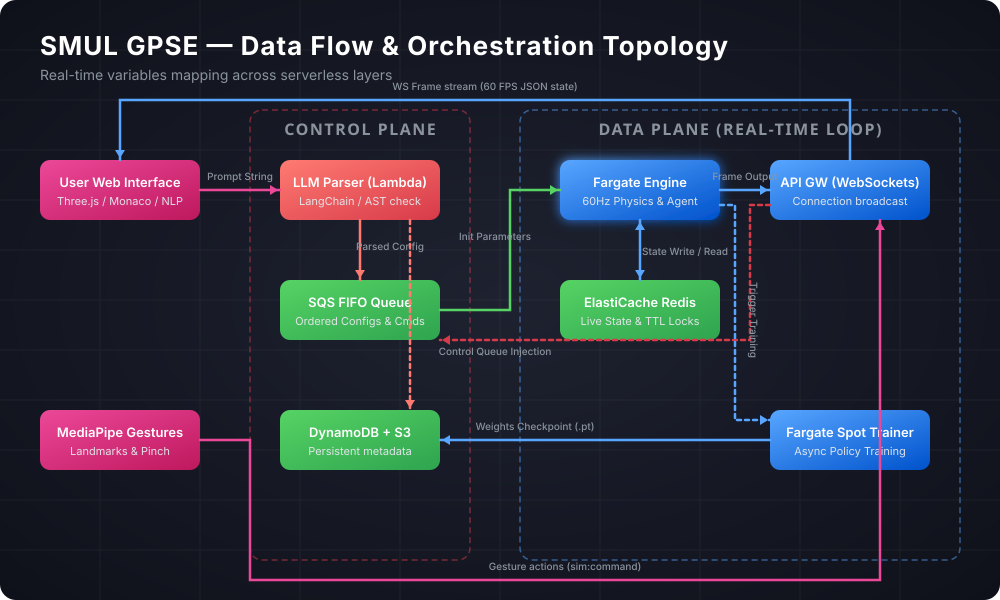
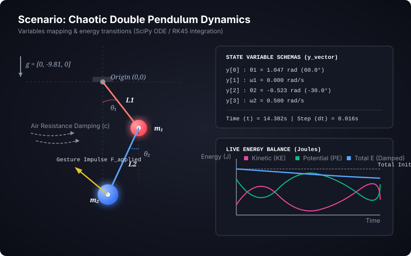
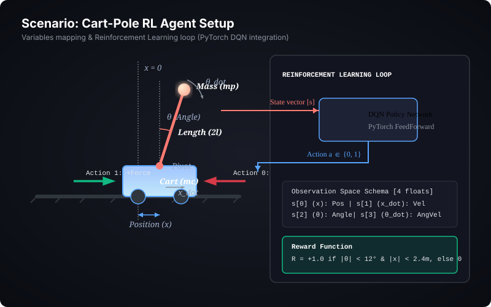
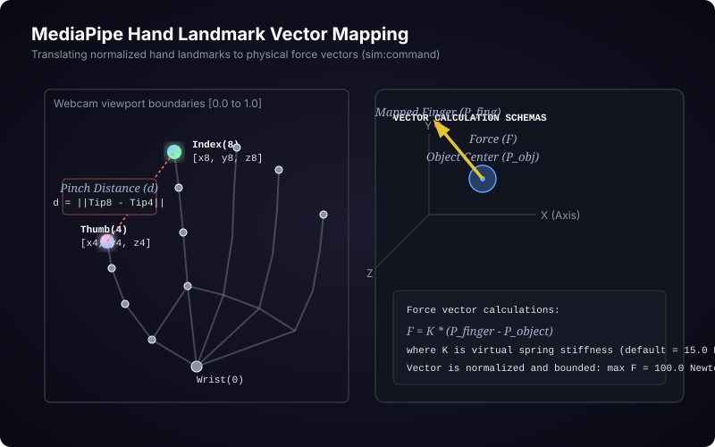

# SMUL GPSE — Variables, Data Types, and Schema Cross-Sections Deep Dive

This document provides a comprehensive blueprint of the variables, data structures, and schemas underpinning the **SMUL General Purpose Simulation Engine (GPSE)**. It maps how dynamic physical quantities, machine learning spaces, gesture inputs, and system metadata interact across our serverless API layers, caching nodes, and simulation runner loops.

---

## 1. Architectural Overview & Variable Flow Lifecycle

In SMUL GPSE's serverless model, simulation variables flow through a multi-stage lifecycle, undergoing transformations across different data formats:



### Lifecycle State Types
- **Static Configurations**: Stored in **DynamoDB** (JSON schemas, coordinates, system parameters).
- **Transient State Blocks**: Cached in **Redis** (high-frequency floats, vectors, and execution metadata).
- **Action Streams**: Enqueued in **SQS FIFO** (in-order delta updates, forces, and parameters).
- **Serialised Snapshots**: Saved in **Amazon S3** (compressed numpy/json arrays of historical trajectories).

---

## 2. Core Schemas and Database Models

Below are the schema specifications mapping variables to concrete data types.

### 2.1 DynamoDB Entities

#### A. Projects Table (`smul-projects`)
Stores metadata of user workspaces.

```json
{
  "$schema": "https://json-schema.org/draft/2020-12/schema",
  "title": "ProjectRecord",
  "type": "object",
  "properties": {
    "projectId": { "type": "string", "format": "uuid" },
    "userId": { "type": "string" },
    "name": { "type": "string", "maxLength": 100 },
    "description": { "type": "string", "maxLength": 500 },
    "createdAt": { "type": "integer" },
    "updatedAt": { "type": "integer" },
    "scenariosList": {
      "type": "array",
      "items": { "type": "string", "format": "uuid" }
    }
  },
  "required": ["projectId", "userId", "name", "createdAt", "updatedAt"]
}
```

#### B. Simulations Table (`smul-simulations`)
Controls simulation status and links to execution runtimes.

```json
{
  "$schema": "https://json-schema.org/draft/2020-12/schema",
  "title": "SimulationRecord",
  "type": "object",
  "properties": {
    "simulationId": { "type": "string", "format": "uuid" },
    "projectId": { "type": "string", "format": "uuid" },
    "status": { 
      "type": "string", 
      "enum": ["PENDING", "STARTING", "RUNNING", "STOPPED", "FAILED"] 
    },
    "engineType": { "type": "string", "enum": ["PYBULLET", "SCIPY_ODE", "CUSTOM_CONTAINER"] },
    "configS3Url": { "type": "string", "format": "uri" },
    "generatedCodeS3Url": { "type": "string", "format": "uri" },
    "executionTimeLimit": { "type": "integer", "minimum": 10, "maximum": 86400 },
    "idleTimeout": { "type": "integer", "default": 30 },
    "createdAt": { "type": "integer" },
    "stoppedAt": { "type": "integer" },
    "errorMessage": { "type": "string" }
  },
  "required": ["simulationId", "projectId", "status", "engineType", "createdAt"]
}
```

### 2.2 SQS FIFO Message Schemas

All simulation controls must be grouped via `MessageGroupId = simulationId`.

#### Simulation Start Configuration
Payload pushed by the API gateway backend to kick off the container tasks:

```typescript
interface SimulationStartPayload {
  simulationId: string;
  projectId: string;
  engine: 'PYBULLET' | 'SCIPY_ODE' | 'CUSTOM_CONTAINER';
  physicsConfig: {
    gravity: [number, number, number]; // [gx, gy, gz] in m/s^2
    timeStep: number;                 // dt in seconds (e.g. 0.0166)
    damping: number;                  // linear damping constant
    parameters: Record<string, number>; // Dynamic physics constants (e.g. pendulum length, mass)
  };
  initialState: {
    positions: Record<string, [number, number, number]>;
    velocities: Record<string, [number, number, number]>;
    rotations: Record<string, [number, number, number, number]>; // Quaternions [x, y, z, w]
  };
  codeSnippetUrl: string; // S3 link to code to run inside engine
}
```

### 2.3 Redis Transient State Keys

Redis acts as our live data plane bus, providing sub-millisecond state caching.

| Key | Redis Type | Structure / Fields | Description |
|---|---|---|---|
| `sim:{id}:state` | String (JSON) | `{"time": float, "frame": int, "objects": [...], "energy": {...}}` | Current state of all simulation objects. |
| `sim:{id}:connections` | Set | `[connectionId1, connectionId2, ...]` | List of clients connected via WebSockets. |
| `sim:{id}:commands` | List (FIFO) | Array of JSON strings | Backlogged commands parsed from client gestures. |
| `sim:{id}:lock` | String | Token (with 5-second TTL) | Used to prevent race conditions during distributed updates. |

---

## 3. Scenario-Specific Schema & Variable Deep Dives

To illustrate how variables cross-cut schemas across diverse mathematical environments, we examine three core scenarios.

---

### Scenario A: Chaotic Double Pendulum with Air Resistance & Damping

In this scenario, a double pendulum undergoes chaotic motion governed by a system of non-linear ordinary differential equations (ODEs). The state transitions are solved at ~60Hz via SciPy's `solve_ivp` engine.



#### 1. State Variables & Physical Parameters
*   $\theta_1, \theta_2$: Angles of pendulum rods relative to the vertical axis (float, radians).
*   $\omega_1, \omega_2$: Angular velocities (float, rad/s).
*   $\alpha_1, \alpha_2$: Angular accelerations (float, rad/s²).
*   $L_1, L_2$: Length of rods (float, meters).
*   $m_1, m_2$: Masses of bobs (float, kg).
*   $c$: Damping coefficient (float, N·s/m).

#### 2. Schema Definition for Pendulum Configurations
```typescript
interface DoublePendulumConfig {
  m1: number;       // Mass of top bob
  m2: number;       // Mass of bottom bob
  l1: number;       // Length of top rod
  l2: number;       // Length of bottom rod
  g: number;        // Gravitational acceleration (default 9.81)
  damping: number;  // Joint/air damping coefficient (default 0.05)
  initialTheta1: number; // In radians
  initialTheta2: number;
  initialOmega1: number; // In rad/s
  initialOmega2: number;
}
```

#### 3. Mathematical State Vector
$$\mathbf{y} = [\theta_1, \omega_1, \theta_2, \omega_2]^T$$

#### 4. Fargate Simulation Code Implementation (SciPy ODE Integration)
Below is the execution harness running inside the container:

```python
import numpy as np
from scipy.integrate import solve_ivp
import json

class DoublePendulumSimulation:
    def __init__(self, config: dict):
        self.m1 = float(config.get("m1", 1.0))
        self.m2 = float(config.get("m2", 1.0))
        self.l1 = float(config.get("l1", 1.0))
        self.l2 = float(config.get("l2", 1.0))
        self.g = float(config.get("g", 9.81))
        self.damping = float(config.get("damping", 0.05))
        
        # Initial state vector: [theta1, omega1, theta2, omega2]
        self.y = np.array([
            float(config.get("initialTheta1", 1.0)),
            float(config.get("initialOmega1", 0.0)),
            float(config.get("initialTheta2", 1.0)),
            float(config.get("initialOmega2", 0.0))
        ])
        self.t = 0.0
        self.external_impulse = np.array([0.0, 0.0]) # Force inputs [fx, fy] from gestures
        
    def equations(self, t, y):
        t1, w1, t2, w2 = y
        m1, m2, l1, l2, g = self.m1, self.m2, self.l1, self.l2, self.g
        
        delta = t1 - t2
        
        # Equations of motion for double pendulum (derived via Lagrangian dynamics)
        den1 = l1 * (2*m1 + m2 - m2 * np.cos(2*t1 - 2*t2))
        num1 = -g * (2*m1 + m2) * np.sin(t1) - m2 * g * np.sin(t1 - 2*t2) - 2 * np.sin(delta) * m2 * (w2**2 * l2 + w1**2 * l1 * np.cos(delta))
        alpha1 = num1 / den1
        
        den2 = l2 * (2*m1 + m2 - m2 * np.cos(2*t1 - 2*t2))
        num2 = 2 * np.sin(delta) * (w1**2 * l1 * (m1 + m2) + g * (m1 + m2) * np.cos(t1) + w2**2 * l2 * m2 * np.cos(delta))
        alpha2 = num2 / den2
        
        # Apply air resistance damping & external force
        d_omega1 = alpha1 - self.damping * w1 + self.external_impulse[0]
        d_omega2 = alpha2 - self.damping * w2 + self.external_impulse[1]
        
        # Reset external impulses after application
        self.external_impulse = np.array([0.0, 0.0])
        
        return [w1, d_omega1, w2, d_omega2]

    def compute_energy(self) -> dict:
        t1, w1, t2, w2 = self.y
        m1, m2, l1, l2, g = self.m1, self.m2, self.l1, self.l2, self.g
        
        # Positions
        x1 = l1 * np.sin(t1)
        y1 = -l1 * np.cos(t1)
        x2 = x1 + l2 * np.sin(t2)
        y2 = y1 - l2 * np.cos(t2)
        
        # Velocities
        vx1 = l1 * w1 * np.cos(t1)
        vy1 = l1 * w1 * np.sin(t1)
        vx2 = vx1 + l2 * w2 * np.cos(t2)
        vy2 = vy1 + l2 * w2 * np.sin(t2)
        
        # Kinetic & Potential Energy
        ke1 = 0.5 * m1 * (vx1**2 + vy1**2)
        ke2 = 0.5 * m2 * (vx2**2 + vy2**2)
        pe1 = m1 * g * y1
        pe2 = m2 * g * y2
        
        return {
            "kinetic": float(ke1 + ke2),
            "potential": float(pe1 + pe2),
            "total": float(ke1 + ke2 + pe1 + pe2)
        }

    def step(self, dt: float) -> dict:
        # Perform 1 step of integration
        sol = solve_ivp(self.equations, [self.t, self.t + dt], self.y, method='RK45')
        self.y = sol.y[:, -1]
        self.t += dt
        
        # Return state in mapped WebSocket schema
        t1, _, t2, _ = self.y
        return {
            "time": self.t,
            "objects": [
                {
                    "id": "bob_1",
                    "position": [float(self.l1 * np.sin(t1)), float(-self.l1 * np.cos(t1)), 0.0],
                    "angles": [float(t1)]
                },
                {
                    "id": "bob_2",
                    "position": [
                        float(self.l1 * np.sin(t1) + self.l2 * np.sin(t2)),
                        float(-self.l1 * np.cos(t1) - self.l2 * np.cos(t2)),
                        0.0
                    ],
                    "angles": [float(t2)]
                }
            ],
            "energy": self.compute_energy()
        }
```

#### 5. Cross-Section Schema Map (Fargate to Client Output)
```json
{
  "type": "object",
  "properties": {
    "time": { "type": "number" },
    "objects": {
      "type": "array",
      "items": {
        "type": "object",
        "properties": {
          "id": { "type": "string" },
          "position": { 
            "type": "array", 
            "minItems": 3, "maxItems": 3, 
            "items": { "type": "number" } 
          },
          "angles": { "type": "array", "items": { "type": "number" } }
        },
        "required": ["id", "position"]
      }
    },
    "energy": {
      "type": "object",
      "properties": {
        "kinetic": { "type": "number" },
        "potential": { "type": "number" },
        "total": { "type": "number" }
      },
      "required": ["kinetic", "potential", "total"]
    }
  },
  "required": ["time", "objects", "energy"]
}
```

---

### Scenario B: Cart-Pole Agent Reinforcement Learning (DQN Training/Inference)

Here, the system simulates a balancing Cart-Pole task. A neural network agent (PyTorch) is evaluated inside the Fargate container, while metrics are pushed real-time to the dashboard.



#### 1. Observation State Variables (Tensor Float Array)
- $x$: Cart position (range: $[-4.8, 4.8]$ meters).
- $\dot{x}$: Cart velocity (range: $[-\infty, \infty]$ m/s).
- $\theta$: Pole angle relative to vertical (range: $[-24^\circ, 24^\circ]$).
- $\dot{\theta}$: Pole angular velocity (range: $[-\infty, \infty]$ rad/s).

#### 2. Action Variables (Integer Binary Choice)
- $A \in \{0, 1\}$: $0$ for pushing Cart to the Left (constant force $-F$), $1$ for pushing Cart to the Right ($+F$).

#### 3. Reward Function (Float Metric)
- $R = 1.0$ for every timestep the pole remains upright.
- $R = 0.0$ if the pole falls ($\theta > 12^\circ$ or $x > 2.4$m).

#### 4. DQN Policy Structure and Schema (PyTorch Interface)
```python
import torch
import torch.nn as nn
import random

# JSON Schema definition representing model metadata passed in REST API /agent/train
"""
{
  "type": "object",
  "properties": {
    "learningRate": { "type": "number", "minimum": 1e-5, "maximum": 1e-1 },
    "gamma": { "type": "number", "minimum": 0.9, "maximum": 0.999 },
    "epsilonDecay": { "type": "number", "minimum": 0.9, "maximum": 0.9999 },
    "hiddenDimensions": { "type": "array", "items": { "type": "integer" } }
  }
}
"""

class DQNPolicy(nn.Module):
    def __init__(self, obs_dim=4, action_dim=2, hidden_dim=[64, 64]):
        super().__init__()
        layers = []
        in_dim = obs_dim
        for h in hidden_dim:
            layers.append(nn.Linear(in_dim, h))
            layers.append(nn.ReLU())
            in_dim = h
        layers.append(nn.Linear(in_dim, action_dim))
        self.network = nn.Sequential(*layers)
        
    def forward(self, x: torch.Tensor) -> torch.Tensor:
        return self.network(x)

class CartPoleSim:
    def __init__(self, policy: DQNPolicy):
        self.policy = policy
        # State vector: [x, x_dot, theta, theta_dot]
        self.state = np.array([0.0, 0.0, 0.0, 0.0])
        self.gravity = 9.8
        self.masscart = 1.0
        self.masspole = 0.1
        self.total_mass = (self.masspole + self.masscart)
        self.length = 0.5 # half the pole's length
        self.polemass_length = (self.masspole * self.length)
        self.force_mag = 10.0
        self.tau = 0.02 # dt
        self.steps = 0
        
    def step(self, action: int) -> tuple:
        x, x_dot, theta, theta_dot = self.state
        force = self.force_mag if action == 1 else -self.force_mag
        
        costheta = np.cos(theta)
        sintheta = np.sin(theta)
        
        temp = (force + self.polemass_length * theta_dot**2 * sintheta) / self.total_mass
        thetaacc = (self.gravity * sintheta - costheta * temp) / (self.length * (4.0/3.0 - self.masspole * costheta**2 / self.total_mass))
        xacc = temp - self.polemass_length * thetaacc * costheta / self.total_mass
        
        # Euler integration
        x = x + self.tau * x_dot
        x_dot = x_dot + self.tau * xacc
        theta = theta + self.tau * theta_dot
        theta_dot = theta_dot + self.tau * thetaacc
        
        self.state = np.array([x, x_dot, theta, theta_dot])
        self.steps += 1
        
        # Check termination variables
        terminated = bool(
            x < -2.4 or x > 2.4 or
            theta < -0.209 or theta > 0.209 # ~12 degrees
        )
        
        reward = 1.0 if not terminated else 0.0
        return self.state, reward, terminated

    def choose_action(self, epsilon: float) -> int:
        if random.random() < epsilon:
            return random.randint(0, 1)
        state_t = torch.FloatTensor(self.state).unsqueeze(0)
        with torch.no_grad():
            q_values = self.policy(state_t)
            return int(torch.argmax(q_values).item())
```

#### 5. Cross-Section Schema Map (Training Metrics Streamed to Front-End)
During execution, metric outputs are published to WebSocket:

```json
{
  "type": "object",
  "properties": {
    "episode": { "type": "integer" },
    "totalReward": { "type": "number" },
    "loss": { "type": "number" },
    "epsilon": { "type": "number" },
    "runtimeMs": { "type": "number" },
    "modelCheckpointS3": { "type": "string", "format": "uri" }
  },
  "required": ["episode", "totalReward", "loss", "epsilon"]
}
```

---

### Scenario C: MediaPipe Gesture Controls & Impulse Vectors

In this interactive scenario, the browser captures joint locations from a webcam and calculates force vectors to act on items inside the physical simulation container.



#### 1. Landmark Variables (MediaPipe Output)
MediaPipe tracks 21 hand landmarks ($L_0$ to $L_{20}$), each having coordinates:
*   $x_i, y_i, z_i$: Position parameters normalized between $[0.0, 1.0]$ based on screen dimensions (float).

#### 2. Processed Interaction Variables
*   `pinchDistance`: $d_{\text{pinch}} = \|\vec{L}_8 - \vec{L}_4\|_2$ (float). If $d_{\text{pinch}} < 0.05$, pinch is active.
*   `targetObjectId`: ID of selected physical entity in viewport (string).
*   `forceVector`: Dynamic force $\vec{F}_{\text{applied}} = [f_x, f_y, f_z]$ (array of floats, Newtons). Calculated as:
    $$\vec{F}_{\text{applied}} = K \cdot (\vec{P}_{\text{current\_finger}} - \vec{P}_{\text{object\_center}})$$
    Where $K$ is the virtual spring constant (elastic pull).

#### 3. WebSocket Gesture Command Schema (`sim:command`)
Sent from the client browser to the AWS API Gateway, routing to the Fargate simulation SQS queue:

```json
{
  "$schema": "https://json-schema.org/draft/2020-12/schema",
  "title": "WebSocketGestureCommand",
  "type": "object",
  "properties": {
    "action": { "type": "string", "const": "sim:command" },
    "simulationId": { "type": "string", "format": "uuid" },
    "payload": {
      "type": "object",
      "properties": {
        "commandType": { "type": "string", "enum": ["APPLY_FORCE", "GRAB", "RELEASE"] },
        "targetObjectId": { "type": "string" },
        "vector": {
          "type": "array",
          "minItems": 3, "maxItems": 3,
          "items": { "type": "number" }
        },
        "magnitude": { "type": "number", "minimum": 0.0 }
      },
      "required": ["commandType", "targetObjectId"]
    }
  },
  "required": ["action", "simulationId", "payload"]
}
```

---

## 4. System-Wide Variable Interaction & Schema Cross-Section Matrix

The following matrix outlines which services ingest, process, store, or output the key variables:

| Variable | Data Type | Origin Component | Store/Bus Medium | Target Consumer | Schema Constraint |
|---|---|---|---|---|---|
| `projectId` | UUID string | Frontend API call | DynamoDB / S3 | API Lambdas | Matches regex `/^[0-9a-f]{8}-...$/` |
| `simulationId` | UUID string | API Lambda | SQS FIFO / Redis | Fargate Engine / UI | Primary Partition Key |
| `connectionId` | String | API GW WS Connect | Redis Set / DynamoDB | WS Broadcast Layer | Generated by AWS API GW |
| `stateVector` | Float Array | Fargate Engine | Redis String / WS | Three.js Viewport | Must conserve energy equations |
| `gestureVector` | Float Array | MediaPipe UI | WS / SQS FIFO | Fargate Engine | Normalised to bounds $[-100, 100]$ |
| `modelWeights` | PyTorch Binary | Training Container | Amazon S3 | Inference Engine | Saved as serialised `.pt` or `.onnx` |
| `codePayload` | String | LLM Parser Lambda | S3 Bucket | Fargate Sandbox | Checked by lint/AST checker |

---

## 5. Coding Harness: Variable Validation and AST Checker

To ensure the safety of LLM-generated code blocks (preventing arbitrary system execution in the serverless containers), we implement an **Abstract Syntax Tree (AST)** validation layer. This code runs in our control plane Lambda before enqueuing to SQS.

```python
import ast
import sys

class SimulationSafetyValidator(ast.NodeVisitor):
    def __init__(self):
        # Whitelisted built-in modules
        self.allowed_modules = {'numpy', 'scipy', 'scipy.integrate', 'math', 'pybullet'}
        # Forbidden actions
        self.forbidden_builtins = {'eval', 'exec', 'open', 'compile', 'getattr', 'setattr'}
        self.is_safe = True
        self.errors = []

    def visit_Import(self, node):
        for alias in node.names:
            name = alias.name.split('.')[0]
            if name not in self.allowed_modules:
                self.is_safe = False
                self.errors.append(f"Unsafe import: '{alias.name}' is not whitelisted.")
        self.generic_visit(node)

    def visit_ImportFrom(self, node):
        if not node.module:
            self.is_safe = False
            self.errors.append("Relative imports are not allowed.")
            return
            
        root_module = node.module.split('.')[0]
        if root_module not in self.allowed_modules:
            self.is_safe = False
            self.errors.append(f"Unsafe import from module: '{node.module}'")
        self.generic_visit(node)

    def visit_Call(self, node):
        # Check if the call is a forbidden builtin function
        if isinstance(node.func, ast.Name):
            if node.func.id in self.forbidden_builtins:
                self.is_safe = False
                self.errors.append(f"Forbidden function call: '{node.func.id}'")
        # Check for system/subprocess calls
        elif isinstance(node.func, ast.Attribute):
            if isinstance(node.func.value, ast.Name) and node.func.value.id in {'os', 'sys', 'subprocess'}:
                self.is_safe = False
                self.errors.append(f"Forbidden OS access call: '{node.func.value.id}.{node.func.attr}'")
        self.generic_visit(node)

def validate_llm_code(code_string: str) -> tuple[bool, list[str]]:
    """
    Parses LLM-generated Python simulation code to guarantee sandbox safety.
    Returns (is_safe, error_messages)
    """
    try:
        tree = ast.parse(code_string)
        validator = SimulationSafetyValidator()
        validator.visit(tree)
        return validator.is_safe, validator.errors
    except SyntaxError as e:
        return False, [f"Syntax error in code: {e.msg} at line {e.lineno}"]

# Test harness validation logic
if __name__ == "__main__":
    malicious_code = """
import os
def run_simulation():
    os.system("rm -rf /")
"""
    safe_code = """
import numpy as np
import math

def step(theta, omega, dt):
    d_theta = omega
    d_omega = -9.81 * math.sin(theta)
    return theta + d_theta * dt, omega + d_omega * dt
"""
    
    print("Validating malicious block...")
    safe, errs = validate_llm_code(malicious_code)
    print(f"Safe: {safe}, Errors: {errs}")
    
    print("\nValidating safe block...")
    safe, errs = validate_llm_code(safe_code)
    print(f"Safe: {safe}, Errors: {errs}")
```

---

## 6. Schema Migration & Versioning Best Practices

As the SMUL GPSE codebase expands, configurations and parameters will change. We implement a **Schema Versioning Pattern**:

1.  **Semantic Schema Fields**: Every config JSON and state event must declare a `$schemaVersion` property (e.g., `"1.2.0"`).
2.  **Backwards Compatibility Pipeline**: The Fargate engine checks the `$schemaVersion` and feeds it to a transformer function when importing configuration properties.
3.  **Forward Proxies**: Major updates in telemetry schemas route through version adapters inside the WebSocket lambda layer, ensuring legacy Three.js dashboards don't crash when variables are renamed.
